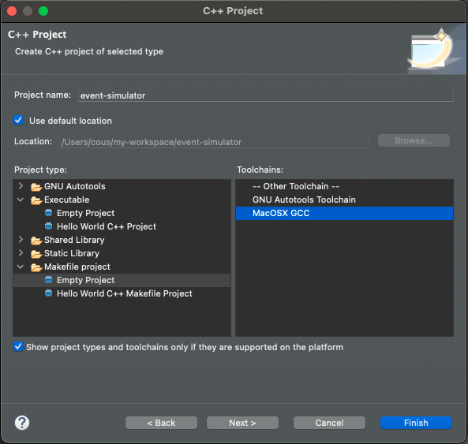
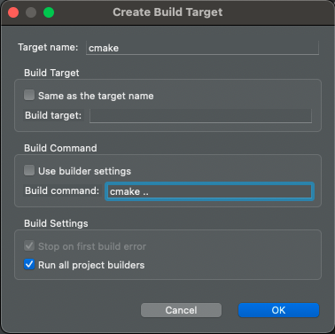

# C++ Multi-Threaded Event Simulator

This is a generic framework to help simulate dynamical systems. Specific use-cases might include:
* a **financial exchange**: where events could represent order submissions or fills
* the **spread of a disease**: where events could represent two people coming into contact or the disease successfully transmitting from one person to another

Each `Simulation` triggers multiple `Events` at non-deterministic time intervals. A simulation is defined by the `ratePerMin` at which events occur on-average and the total length of the simulation: `durationMins`. A `Listener` is notified each time an event is triggered. A `MultiThreadedSimulation` can run multiple simulations in parallel.

## Project Structure

* `src/*`: C++ code that ultimately compiles into a library
* `test/lib/*`: C++ libraries used for testing (e.g. GoogleTest)
* `test/src/*`: C++ unit tests
* `bin/`, `build/`, `lib/` and `include/` are all empty directories until the program is built and installed (see below)

## Building the Project

### Prerequisites

You will need:

* a modern C/C++ compiler
* CMake 3.2+ installed (on a Mac, run `brew install cmake`)

### Checkout

Checkout the code from git into `event-simulator/`:

```bash
❯ git clone https://github.com/t-cousins/C-Event-Simulator event-simulator
```

### Building

To build from the terminal first you need to checkout the git submodules that the project depends on: GoogleTest in this case. Navigate to the `build` folder, which we will use to contain the build artifacts, and use `cmake` to generate the `Makefile`. Lastly use `make` to compile the project and `make install` to copy files into the above project structure.

```bash
❯ cd event-simulator
❯ git submodule init && git submodule update
❯ cd build
❯ cmake ..
❯ make && make install
```

After this, there should be a small static library in `lib/libsimulation.a` and some executables in `bin/`.

## Usage

### From the terminal

You can now use the executable binaries to run the program from the terminal.

#### Unit tests

```bash
❯ bin/simulator_tests
[==========] Running 4 tests from 1 test suite.
[----------] Global test environment set-up.
[----------] 4 tests from SimulationTest
[ RUN      ] SimulationTest.Zero_Duration
[       OK ] SimulationTest.Zero_Duration (0 ms)
[ RUN      ] SimulationTest.Zero_Rate
[       OK ] SimulationTest.Zero_Rate (0 ms)
[ RUN      ] SimulationTest.Seeded_Events
[       OK ] SimulationTest.Seeded_Events (0 ms)
[ RUN      ] SimulationTest.MultiSim_Exception
[       OK ] SimulationTest.MultiSim_Exception (1 ms)
[----------] 4 tests from SimulationTest (1 ms total)

[----------] Global test environment tear-down
[==========] 4 tests from 1 test suite ran. (1 ms total)
[  PASSED  ] 4 tests.
```

#### Simulation

The following runs an illustrative use of the project for two parallel simulations. The actual output will look slightly different on each run.

```bash
❯ bin/simulator
Starting Sim1 
Starting Sim2 
Event Triggered: Sim1:event1 @ 5.73s
Event Triggered: Sim1:event2 @ 12.88s
Event Triggered: Sim1:event3 @ 44.13s
Finished Sim1: 3 events @ 5.00 events per min for 60.00s
Event Triggered: Sim2:event1 @ 97.37s
Event Triggered: Sim2:event2 @ 104.67s
Event Triggered: Sim2:event3 @ 169.72s
Event Triggered: Sim2:event4 @ 178.57s
Finished Sim2: 4 events @ 2.50 events per min for 180.00s
```

### Importing into Eclipse

Follow the previous steps to fully checkout the project from the terminal, but don't run `cmake` or `make`. It's now easy to import the project into Eclipse:

* Create a new project: *File -> New -> Other*
* Select *C/C++ -> C++* Project
* Call the project *event-simulator* and select an empty Makefile project (see below):

* Right-click on the new *event-simulator* project in Project Explorer and select *Import*
* Select *General -> File System*
* Browse to `event-simulator/` where we previously checked-out the project
* Click *Select All* and *Finish*
* Select the *Build Targets* tab on the right-side of Eclipse: here we will create a *Target* to generate Makefiles from the CMakeLists.txt
* Right-click the `build/` folder and *New*
* Fill in the form as illustrated below:  

* Double-click the new *cmake* target. This should generate files in `build/` as if we had performed it from the terminal
* Right-click *event-simulator* in Project Explorer and select *Properties*
* Under *C/C++ Build*, click on *Workspace* and navigate to `build/`
* Finally, right-click *event-simulator* in Project Explorer and hit *Build Project*

### Using it as a C++ library

We build a small static library that can be easily linked into another program.
